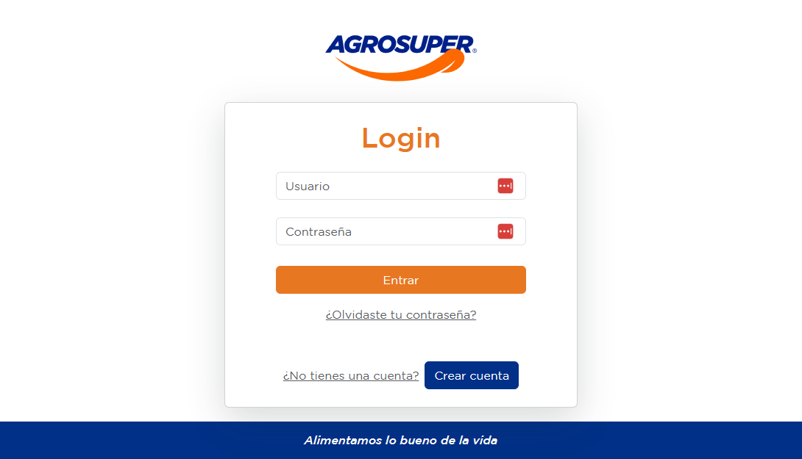
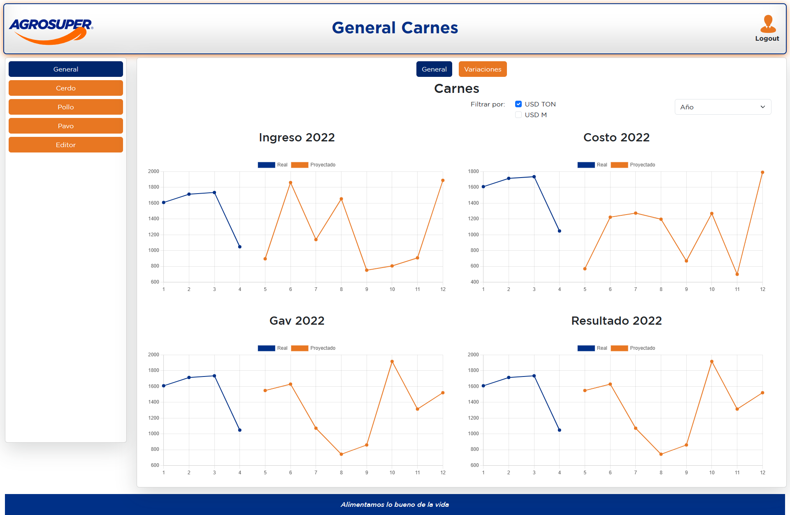
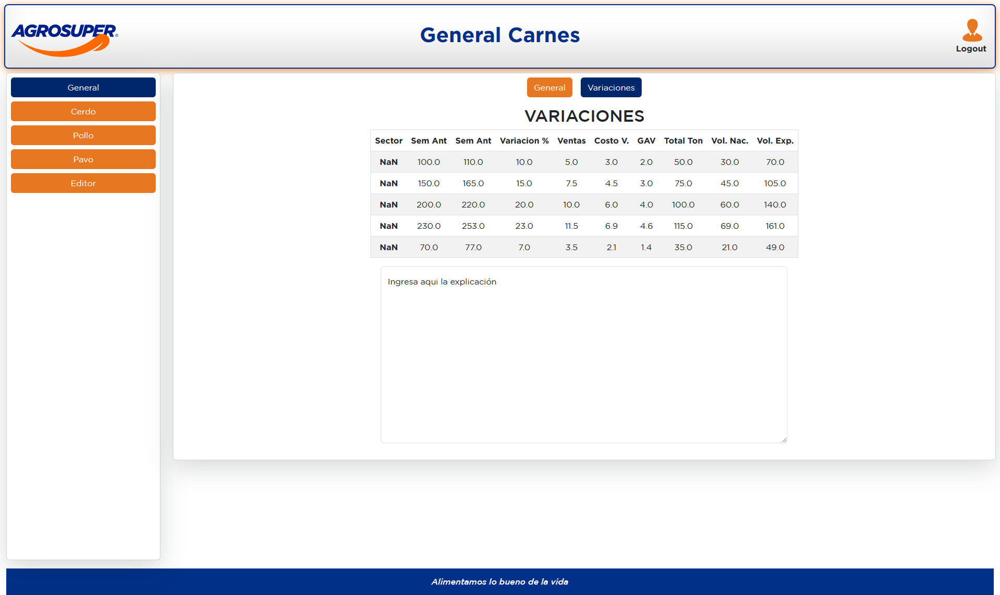
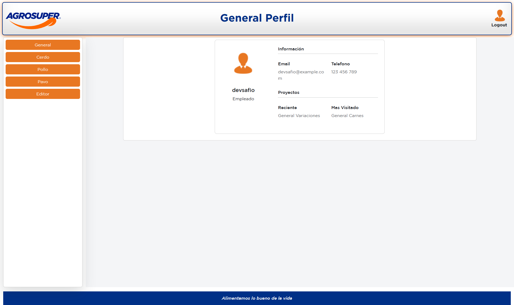
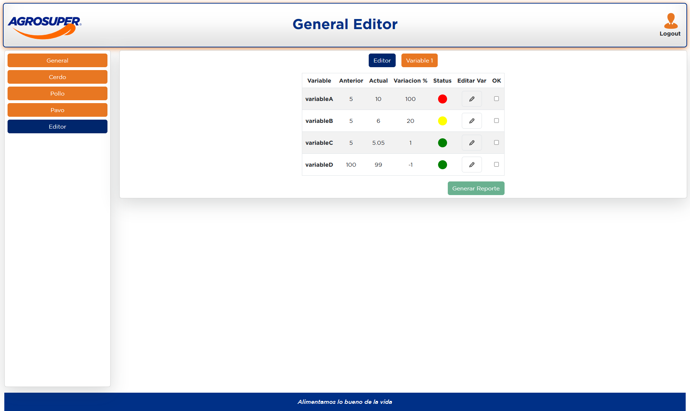

## CHALLENGE BSale - Front End (ECOMMERCE)

## Consideraciones

Este proyecto corresponde al challenge técnico de Agrosuper. 

## Front End

Desarrollado utilizando  **HTML**, **CSS**,  **JavaScript**, **Bootstrap**, **Sass**, **React**,**Redux Toolkit ** y **React Chartjs 2**,. 
Se implento el manejo del estado global con Redux.

### Deploy: 
*https://agrosuper.netlify.app/*
No recomiendo fiarse del deploy porque la URL de la API al no tener un dominio lo toma como no seguro y no realiza bien las peticiones necesarios para un buen comportamiento en el front. 

### Caracteristicas del proyecto

<li> Se utilizó un Auth sencillo como demostración</li>
<li> Se Utilizó Axios para realizar los request al servidor.</li>
<li> Se Utilizó El LocalStorage para almacenar un boleando en caso de loguearse correctamente, solo de forma didactica para cumplir con el requerimiento.</li>
<li> Se protegen las rutas con ese login basico y se permite hacer el Logout.</li>
<li> Se utilizaron en su mayoria componentes y funciones reutilizables que permitiran escalar de manera sencilla en caos de que la data crezca.</li>
<li> Para el manejo de las gráficas se utilizó React Chartjs 2</li>
<li> Al ser una app institucional se dejo a un lado el concepto Mobile First, pero se trato de hacerlo para equipos medianos.</li>
<li> Para la responsividad y estilos se uso *Bootstrap* en su mayoria excepto para los colores caracteristicos de Agrosuper.</li>
<li> Se instalo Sass, pero por cuestión de tiempo se evito usar CSS nativo y manejar solo clases y componentes de Bootstrap.</li>
<li> Dado que utilice nombres de variables autoexplicativas no fue necesario cargar el codigo con comentarios del funcionamiento.</li>

## Tecnologías

| Recursos utilizados       | Enlace                                                                              |
| ------------------------- | ----------------------------------------------------------------------------------- |
| Bootstrap 5.3.0           | [Ir a web ](https://getbootstrap.com/)                                              |
| Redux toolkit             | [Ir a web ](https://redux-toolkit.js.org/)                                          |
| React ChartJS 2           | [Ir a web ](https://react-chartjs-2.js.org/)                                        |

## Problemas enfrentados
1. Redux. Es la primera vez que realizo un proyecto importante con Redux y se me hizo llevadero gracias a los tutoriales en ingles y a mi experiencia con la libreria Vuex de Vue. En teoria tratan de hacer lo mismo con distintas herramientas y me ayudo saber que era lo que necesitaba por ejemplo los computeds de Vuex son un gran as que a primera vista uno creeria que no estaria en Redux. Me quedo con la experiencia obtenida y a seguir practicando con esta tecnologia. 
2. Inputs. En este challenge se utilizaron distintos tipos de inputs (select, checkbox, range, etc). Jugar con la data y renderizar componentes con etiuetas de tipo input que sean reactivas asi como tambien tablas es una excelente manera de poner en practica y a prueba el conocimiento. Como comente, con Vue esto se maneja de una manera un poco mas intuitiva pero una vez entiendes los hooks de React todo se hace mas sencillo. 
3. El tiempo. Lamentablemente solo pude dedicarle el dia Domingo al proyecto ya que me encontraba ocupado esta semana. Sim embargo, estoy muy contento con el resultado obtenido. Me ayudo a manejar muy bien el tiempo efectivo y a pensar muy bien la arquitectura de lo que queria hacer antes de codear. Quedan sin implementar las funciones del ultimo componente.

## Experiencia Agrosuper
Primero agradecerles por la oportunidad de poner en practica mi conocimiento. 
Aunque mi framework principal es Vue, decidi para este challenge utilizar React y ademas manejar el estado global de la aplicación con Redux aunque solo habia hecho un proyecto pequeño anteriormente (para manejos globales he utilizado Vuex de Vue). 
Fue muy grato descubrir React ChartJS 2, me encanto manejar gráficas de esa manera. 

## Capturas

